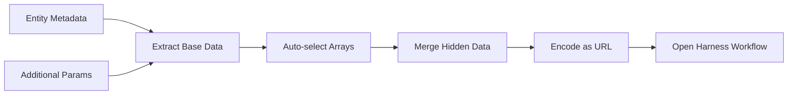

# Backstage Critical Operations Plugin

🚀 A Backstage plugin that seamlessly integrates Day 2 operations with Harness workflows by automatically pre-filling forms with entity metadata.

## ✨ Features

- 🎯 **Smart Metadata Resolution** - Automatically extracts data from entity metadata paths
- 🔗 **Pre-filled Workflow Integration** - Generates URLs that auto-populate Harness workflow forms  
- 🎨 **Multiple Action Support** - Configure multiple operations with custom styling
- 🔒 **Per-Action Hidden Data** - Include action-specific data not visible in the UI
- 📝 **Additional Parameters** - Pull extra metadata from custom paths
- 🔄 **Auto Array Handling** - Automatically selects first array elements (configurable)
- ⚡ **Instant Execution** - Direct workflow execution without confirmation dialogs

## 🚀 Quick Start

### Basic Usage
```tsx
import { Day2OperationsCard } from '@adiyaar/backstage-plugin-critical-operations';

<Day2OperationsCard
  title="Service Operations"
  actions={[
    {
      name: 'Update Service',
      url: 'https://app.harness.io/ng/account/YOUR_ACCOUNT/module/idp/create/templates/default/Update_Template',
      color: 'primary',
      variant: 'contained'
    }
  ]}
  metadataPath="metadata.additionalInfo.deployment"
/>
```

### Advanced Usage with Additional Parameters
```tsx
<Day2OperationsCard
  title="Infrastructure Operations"
  actions={[
    {
      name: 'Scale Service',
      url: 'https://app.harness.io/.../Scale_Template',
      color: 'success',
      variant: 'contained',
      hiddenData: {
        operation_type: 'scale',
        priority: 'high'
      }
    },
    {
      name: 'Delete Service',
      url: 'https://app.harness.io/.../Delete_Template',
      color: 'error',
      variant: 'outlined',
      hiddenData: {
        operation_type: 'delete',
        confirmation_required: true
      }
    }
  ]}
  metadataPath="metadata.additionalInfo.deployment"
  additionalParams={[
    "spec.system",
    "metadata.identifier",
    { path: "spec.owner", key: "team_owner" },
    { path: "metadata.namespace", key: "k8s_namespace" }
  ]}
/>
```

## 📋 API Reference

### Component Props

| Property | Type | Default | Required | Description |
|----------|------|---------|----------|-------------|
| `title` | `string` | `"Day 2 Operations"` | ❌ | Display title for the operations card |
| `actions` | `WorkflowAction[]` | - | ✅ | Array of workflow operations to display |
| `metadataPath` | `string` | - | ✅ | Base path for extracting entity metadata |
| `additionalParams` | `(string \| {path: string, key: string})[]` | - | ❌ | Extra metadata paths to include in form data |
| `autoSelectFirstElement` | `boolean` | `true` | ❌ | Auto-select first element from arrays |

### WorkflowAction Interface

```typescript
interface WorkflowAction {
  name: string;                    // Button display name
  url: string;                     // Harness workflow URL
  color?: 'primary' | 'secondary'  // Button color theme
    | 'success' | 'error' 
    | 'info' | 'warning';
  variant?: 'contained'            // Button style variant
    | 'outlined' | 'text';
  hiddenData?: Record<string, any>; // Action-specific form data
}
```

## 🔧 Configuration Examples

### Entity YAML Setup
Your Backstage entity should have metadata structured like this:

```yaml
apiVersion: backstage.io/v1alpha1
kind: Component
metadata:
  name: my-service
  identifier: service_123
  additionalInfo:
    deployment:
      environment: production
      region: us-east-1
spec:
  system:
    - system:my-org/my-system
  owner: team-platform
```

### Accessing Nested Data

| Path Configuration | Result | Key in Form Data |
|---------------------|--------|------------------|
| `"metadata.identifier"` | `"service_123"` | `identifier` |
| `"spec.system"` | `"system:my-org/my-system"` | `system` (first element) |
| `{path: "spec.owner", key: "team_owner"}` | `"team-platform"` | `team_owner` |
| `metadata.additionalInfo.deployment` | `{environment: "production", region: "us-east-1"}` | Spreads all keys |

## 🎛️ Advanced Features

### Configurable Keys for Additional Parameters
You can now specify custom keys for additional parameters in two ways:

```typescript
// Legacy format - uses last part of path as key
additionalParams: ["spec.system", "metadata.identifier"]
// Results in: { system: "...", identifier: "..." }

// New format - specify custom keys
additionalParams: [
  "spec.system",  // Legacy format
  { path: "spec.owner", key: "team_owner" },  // Custom key
  { path: "metadata.namespace", key: "k8s_namespace" }
]
// Results in: { system: "...", team_owner: "...", k8s_namespace: "..." }
```

### Array Handling
By default, arrays are automatically reduced to their first element:

```typescript
// Entity has: spec.system = ["system:org/sys1", "system:org/sys2"]

additionalParams: ["spec.system"]
// Result: { system: "system:org/sys1" }

// With custom key:
additionalParams: [{ path: "spec.system", key: "primary_system" }]
// Result: { primary_system: "system:org/sys1" }

// To get the full array:
autoSelectFirstElement={false}
// Result: { system: ["system:org/sys1", "system:org/sys2"] }
```

### Hidden Data Priority
Form data is merged in this order (later overrides earlier):
1. Base metadata from `metadataPath`
2. Additional parameters from `additionalParams`
3. Action-specific `hiddenData`

### Generated Workflow URLs
The plugin creates URLs in this format:
```
https://app.harness.io/.../templates/My_Template?formData=%7B...%7D
```

Where `formData` contains URL-encoded JSON with all the resolved metadata.

## 🏗️ How It Works



1. **Extract** metadata from the specified `metadataPath`
2. **Include** additional parameters from `additionalParams` paths
3. **Process** arrays based on `autoSelectFirstElement` setting
4. **Merge** with action-specific `hiddenData`
5. **Encode** everything as a URL parameter
6. **Launch** the Harness workflow with pre-filled forms

## 🎯 Real-World Example

For a service with this metadata:
```yaml
metadata:
  identifier: payment-service
  additionalInfo:
    deployment:
      replicas: 3
      environment: production
spec:
  system: ["system:payments/core"]
```

Using this configuration:
```tsx
additionalParams={[
  "metadata.identifier",
  { path: "spec.system", key: "primary_system" }
]}
```

Results in this form data:
```json
{
  "replicas": 3,
  "environment": "production",
  "identifier": "payment-service",
  "primary_system": "system:payments/core"
}
```

## 🤝 Contributing

1. Fork the repository
2. Create your feature branch (`git checkout -b feature/amazing-feature`)
3. Commit your changes (`git commit -m 'Add amazing feature'`)
4. Push to the branch (`git push origin feature/amazing-feature`)
5. Open a Pull Request

## 📄 License

This project is licensed under the Apache License 2.0 - see the LICENSE file for details.
