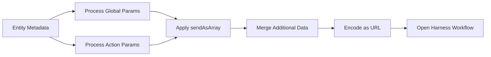

# Backstage Critical Operations Plugin

🚀 A Backstage plugin that seamlessly integrates Day 2 operations with Harness workflows by automatically pre-filling forms with entity metadata.

## ✨ Features

- 🎯 **Smart Metadata Resolution** - Automatically extracts data from entity metadata paths with flexible path resolution
- 🔗 **Pre-filled Workflow Integration** - Generates URLs that auto-populate Harness workflow forms  
- 🎨 **Multiple Action Support** - Configure multiple operations with custom styling and conditional logic
- 🔒 **Per-Action Data** - Include action-specific data and parameters for granular control
- 📝 **Global & Action Parameters** - Pull metadata from custom paths with configurable keys
- 🔢 **Array Conversion Support** - Convert any parameter to array format using `sendAsArray` flag
- 🚫 **Conditional Disabling** - Disable actions based on metadata conditions with tooltips
- ⚡ **Instant Execution** - Direct workflow execution without confirmation dialogs
- 🔧 **Backward Compatibility** - Supports legacy single workflow URL format

## 🚀 Quick Start

### Basic Usage
```tsx
import { Day2OperationsCard } from '@adiyaar/backstage-plugin-critical-operations';

<Day2OperationsCard
  title="Service Operations"
  actions={[
    {
      name: 'Update Service',
      url: 'https://app.harness.io/ng/account/YOUR_ACCOUNT/module/idp/create/templates/default/Update_Template',
      color: 'primary',
      variant: 'contained'
    }
  ]}
  metadataPath="metadata.additionalInfo.deployment"
/>
```

### Advanced Usage with Global Parameters and Conditional Actions
```tsx
<Day2OperationsCard
  title="Infrastructure Operations"
  actions={[
    {
      name: 'Scale Service',
      url: 'https://app.harness.io/.../Scale_Template',
      color: 'success',
      variant: 'contained',
      additionalData: {
        operation_type: 'scale',
        priority: 'high'
      },
      additionalParams: [
        { path: "metadata.additionalInfo.scaling.maxReplicas", key: "max_replicas" }
      ]
    },
    {
      name: 'Delete Service',
      url: 'https://app.harness.io/.../Delete_Template',
      color: 'error',
      variant: 'outlined',
      additionalData: {
        operation_type: 'delete',
        confirmation_required: true
      },
      disableConditions: [{
        path: "metadata.additionalInfo.deployment.environment",
        equals: "production",
        tooltip: "Cannot delete production services"
      }]
    }
  ]}
  metadataPath="metadata.additionalInfo.deployment"
  globalParams={[
    "spec.system",
    "metadata.identifier",
    { path: "spec.owner", key: "team_owner" },
    { path: "metadata.namespace", key: "k8s_namespace" },
    "catalog:component_type"
  ]}
  arrayHandling={{
    extractProperties: true,
    extractionStrategy: "first",
    includeOriginalArrayKey: true
  }}
/>
```

## 📋 API Reference

### Day2OperationsCardProps

| Property | Type | Default | Required | Description |
|----------|------|---------|----------|-------------|
| `title` | `string` | `"Day 2 Operations"` | ❌ | Display title for the operations card |
| `workflowUrl` | `string` | - | ❌ | Single workflow URL (legacy support) |
| `actions` | `WorkflowAction[]` | - | ❌ | Array of workflow operations to display |
| `metadataPath` | `string` | - | ✅ | Root path for metadata extraction (e.g., "metadata.new") |
| `globalParams` | `(string \| {path: string, key: string, sendAsArray?: boolean})[]` | - | ❌ | Global metadata paths included in all actions |
| `autoSelectFirstElement` | `boolean` | `true` | ❌ | Auto-select first element from arrays |

### WorkflowAction Interface

```typescript
interface WorkflowAction {
  name: string;                    // Button display name
  url: string;                     // Harness workflow URL
  color?: 'primary' | 'secondary'  // Button color theme
    | 'success' | 'error' 
    | 'info' | 'warning';
  variant?: 'contained'            // Button style variant
    | 'outlined' | 'text';
  additionalData?: Record<string, any>;  // Action-specific data (overrides metadata)
  additionalParams?: (string | { path: string; key: string; sendAsArray?: boolean })[]; // Per-action metadata paths
  disableConditions?: DisableCondition[]; // Conditions to disable this action
  disabledTooltip?: string;        // General tooltip when disabled
}
```

### DisableCondition Interface

```typescript
interface DisableCondition {
  path: string;           // Metadata path to check (e.g., "metadata.deployment.state")
  equals?: any;           // Disable if value equals this
  notEquals?: any;        // Disable if value does not equal this
  in?: any[];            // Disable if value is in this array
  notIn?: any[];         // Disable if value is not in this array
  tooltip?: string;       // Tooltip when disabled due to this condition
}
```

### Parameter Configuration

```typescript
// String format - uses last path segment as key
type StringParam = string;

// Object format - with optional array conversion
interface ObjectParam {
  path: string;           // Metadata path to extract from
  key: string;            // Key to use in form data
  sendAsArray?: boolean;  // Convert value to array format [value] (default: false)
}

type ParamConfig = StringParam | ObjectParam;
```

## 🔧 Configuration Examples

### Entity YAML Setup
Your Backstage entity should have metadata structured like this:

```yaml
apiVersion: backstage.io/v1alpha1
kind: Component
metadata:
  name: my-service
  identifier: service_123
  additionalInfo:
    deployment:
      environment: production
      region: us-east-1
spec:
  system:
    - system:my-org/my-system
  owner: team-platform
```

### Parameter Configuration Examples

| Configuration | Result | Key in Form Data | Notes |
|---------------|--------|------------------|-------|
| `"metadata.identifier"` | `"service_123"` | `identifier` | String format - uses last path segment |
| `{path: "spec.owner", key: "team_owner"}` | `"team-platform"` | `team_owner` | Object format - custom key |
| `{path: "metadata.config", key: "entries_update", sendAsArray: true}` | `[{...}]` | `entries_update` | Converts object to array |
| `"catalog:component_type"` | `"component_type"` | `component_type` | Direct catalog value |

## 🎛️ Advanced Features

### Parameter Types and Array Conversion

The component supports flexible parameter configuration with optional array conversion:

```typescript
// Global parameters - applied to all actions
globalParams: [
  "spec.system",  // String format
  { path: "spec.owner", key: "team_owner" },  // Object format with custom key
  { path: "metadata.resourceConfig", key: "entries_update", sendAsArray: true },  // Convert to array
  "catalog:service_type"  // Direct catalog value
]

// Per-action parameters - only for specific actions
actions: [{
  name: "Update Service",
  url: "https://...",
  additionalParams: [
    { path: "metadata.scaling.maxReplicas", key: "max_replicas", sendAsArray: true }
  ],
  additionalData: {
    operation_type: "update",
    priority: "high"
  }
}]
```

### Array Conversion with sendAsArray

Convert any parameter value to array format using the `sendAsArray` flag:

```typescript
// Configuration
additionalParams: [
  {
    path: "metadata.resourceConfig",
    key: "entries_update", 
    sendAsArray: true  // Converts object to [object]
  }
]
```

**Example**: Entity has `resourceConfig: { type: "s3", region: "us-west-2" }`

```typescript
// With sendAsArray: false (default)
// Result: { entries_update: { type: "s3", region: "us-west-2" } }

// With sendAsArray: true
// Result: { entries_update: [{ type: "s3", region: "us-west-2" }] }
```

### Conditional Action Disabling

Disable actions based on entity metadata conditions:

```typescript
disableConditions: [
  {
    path: "metadata.environment",
    equals: "production",
    tooltip: "Cannot delete production services"
  },
  {
    path: "metadata.status",
    in: ["archived", "deprecated"],
    tooltip: "Service is not active"
  },
  {
    path: "spec.lifecycle",
    notEquals: "experimental",
    tooltip: "Only experimental services can use this feature"
  }
]
```

### Data Merge Priority
Form data is merged in this order (later overrides earlier):
1. Global parameters from `globalParams`
2. Per-action parameters from `additionalParams`  
3. Action-specific `additionalData`

**Note**: The `sendAsArray` conversion is applied during parameter processing.

### Generated Workflow URLs
The plugin creates URLs in this format:
```
https://app.harness.io/.../templates/My_Template?formData=%7B...%7D
```

Where `formData` contains URL-encoded JSON with all the resolved metadata.

## 🏗️ How It Works



1. **Extract** global parameters from `globalParams`
2. **Extract** per-action parameters from `additionalParams`
3. **Apply** `sendAsArray` conversion where specified
4. **Merge** with action-specific `additionalData`
5. **Encode** everything as a URL parameter
6. **Launch** the Harness workflow with pre-filled forms

## 🎯 Complete Real-World Example

For a service with this metadata:
```yaml
metadata:
  identifier: payment-service
  additionalInfo:
    deployment:
      replicas: 3
      environment: production
      entries:
        - name: payment-api
          port: 8080
          protocol: http
        - name: payment-worker  
          port: 9090
          protocol: grpc
spec:
  system: ["system:payments/core"]
  owner: team-payments
```

Using this configuration:
```tsx
<Day2OperationsCard
  title="Payment Service Operations"
  globalParams={[
    "metadata.identifier",
    { path: "spec.owner", key: "team_owner" },
    "catalog:service_type"
  ]}
  actions={[{
    name: "Update Service",
    url: "https://app.harness.io/.../Update_Template",
    additionalParams: [
      { path: "spec.system", key: "primary_system" },
      { path: "metadata.additionalInfo.deployment.entries", key: "entries_update", sendAsArray: true }
    ],
    additionalData: {
      operation: "update",
      priority: "normal"
    }
  }]}
/>
```

Results in this form data:
```json
{
  "identifier": "payment-service",
  "team_owner": "team-payments",
  "service_type": "service_type",
  "primary_system": "system:payments/core",
  "entries_update": [
    {
      "name": "payment-api",
      "port": 8080,
      "protocol": "http"
    }
  ],
  "operation": "update",
  "priority": "normal"
}
```

## 🤝 Contributing

1. Fork the repository
2. Create your feature branch (`git checkout -b feature/amazing-feature`)
3. Commit your changes (`git commit -m 'Add amazing feature'`)
4. Push to the branch (`git push origin feature/amazing-feature`)
5. Open a Pull Request

## 📄 License

This project is licensed under the Apache License 2.0 - see the LICENSE file for details.
