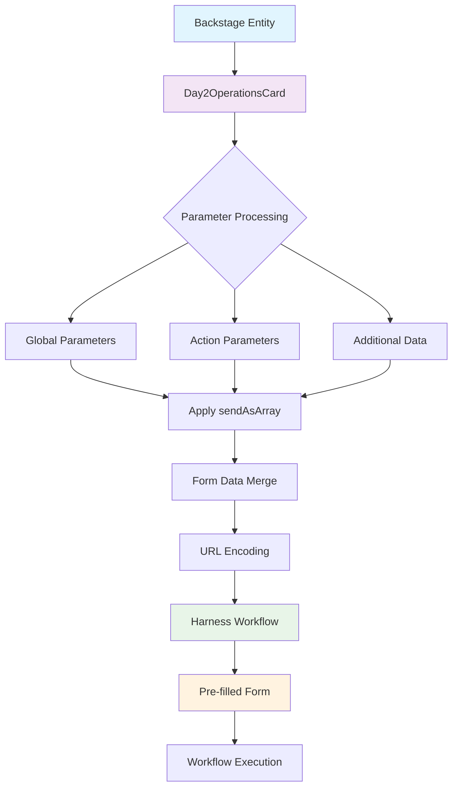
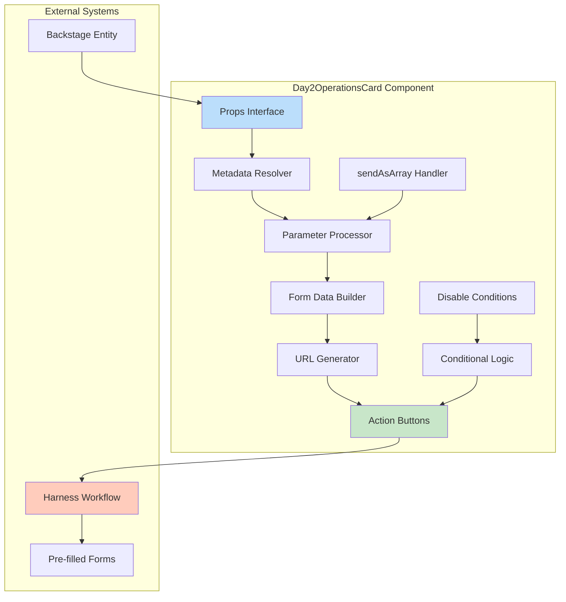
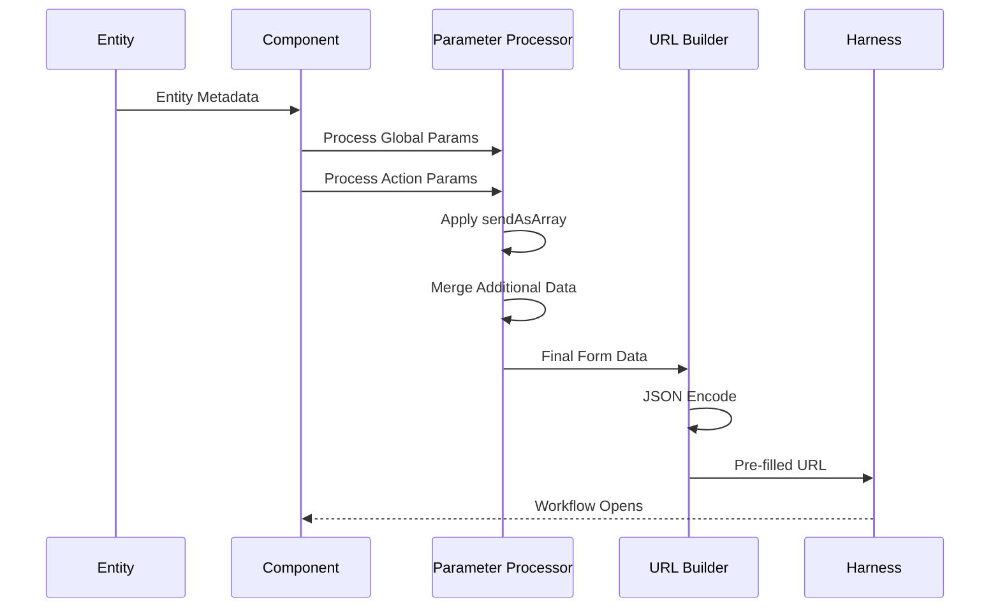
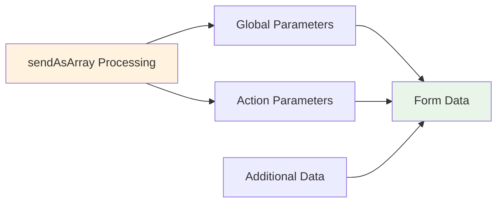

# Backstage Critical Operations Plugin

🚀 A powerful Backstage plugin that seamlessly integrates Day 2 operations with Harness workflows by automatically pre-filling forms with entity metadata.

[](https://github.com/adiyaar24/Critical-Operations/releases/tag/0.4.4)
[](https://www.typescriptlang.org/)
[](https://backstage.io/)
[](https://www.harness.io/products/internal-developer-portal)

## 📖 Table of Contents

- [Features](#-features)
- [Quick Start](#-quick-start)
- [Architecture](#-architecture)
- [Installation](#-installation)
- [Configuration](#-configuration)
- [API Reference](#-api-reference)
- [Examples](#-examples)
- [Troubleshooting](#-troubleshooting)
- [Contributing](#-contributing)

## ✨ Features

### 🎯 Core Capabilities
- **Smart Metadata Resolution** - Automatically extracts data from entity metadata paths with flexible path resolution
- **Pre-filled Workflow Integration** - Generates URLs that auto-populate Harness workflow forms  
- **Multiple Action Support** - Configure multiple operations with custom styling and conditional logic
- **Instant Execution** - Direct workflow execution without confirmation dialogs

### 🔧 Advanced Configuration
- **Flexible Parameter System** - Pull metadata from custom paths with configurable keys
- **Array Conversion Support** - Convert any parameter to array format using `sendAsArray` flag
- **Conditional Disabling** - Disable actions based on metadata conditions with tooltips
- **Per-Action Data** - Include action-specific data and parameters for granular control

## 🚀 Quick Start

### Installation

```bash
# Install the plugin in your Backstage app
yarn add @adiyaar/backstage-plugin-critical-operations
```

### Basic Usage

```tsx
import { Day2OperationsCard } from '@adiyaar/backstage-plugin-critical-operations';

<Day2OperationsCard
  title="Service Operations"
  globalParams={[
    "metadata.name",
    { path: "spec.owner", key: "team_owner" }
  ]}
  actions={[
    {
      name: 'Update Service',
      color: 'primary',
      variant: 'contained',
      additionalParams: [
        { path: "metadata.resourceConfig", key: "entries_update", sendAsArray: true }
      ]
    }
  ]}
/>
```

> **Note**: The workflow URL is read from `metadata.workflowUrl` in your entity's catalog-info.yaml. Make sure to set this value to enable Day 2 Operations.

### 🎯 Want More Examples?
👉 **See [USAGE_EXAMPLE.md](./USAGE_EXAMPLE.md) for comprehensive examples, real-world scenarios, and troubleshooting guide**

## 🏗️ Architecture

### Data Flow Overview



### Component Architecture



### Parameter Processing Flow



## 📋 API Reference

### Day2OperationsCardProps

| Property | Type | Default | Required | Description |
|----------|------|---------|----------|-------------|
| `title` | `string` | `"Day 2 Operations"` | ❌ | Display title for the operations card |
| `globalParams` | `ParamConfig[]` | `[]` | ❌ | Global metadata paths included in all actions |
| `actions` | `WorkflowAction[]` | - | ✅ | Array of workflow operations to display |
| `autoSelectFirstElement` | `boolean` | `true` | ❌ | Auto-select first element from arrays |

### Parameter Configuration Types

```typescript
// String format - uses last path segment as key
type StringParam = string;

// Object format - with optional array conversion
interface ObjectParam {
  path: string;           // Metadata path to extract from
  key: string;            // Key to use in form data
  sendAsArray?: boolean;  // Convert value to array format [value]
}

type ParamConfig = StringParam | ObjectParam;
```

### WorkflowAction Interface

```typescript
interface WorkflowAction {
  name: string;                    // Button display name
  color?: 'primary' | 'secondary'  // Button color theme
    | 'success' | 'error' 
    | 'info' | 'warning';
  variant?: 'contained'            // Button style variant
    | 'outlined' | 'text';
  additionalData?: Record<string, any>;  // Action-specific data
  additionalParams?: ParamConfig[];      // Per-action metadata paths
  disableConditions?: DisableCondition[]; // Conditions to disable action
}
```

> **Note**: The workflow URL is automatically read from `metadata.workflowUrl` in your entity metadata. You don't need to specify it per action.

### DisableCondition Interface

```typescript
interface DisableCondition {
  path: string;           // Metadata path to check
  equals?: any;           // Disable if value equals this
  notEquals?: any;        // Disable if value does not equal this
  in?: any[];            // Disable if value is in this array
  notIn?: any[];         // Disable if value is not in this array
  tooltip?: string;       // Tooltip when disabled due to this condition
}
```

## 🔧 Configuration

### Entity Metadata Structure

Your Backstage entity should have metadata structured for optimal plugin usage:

```yaml
apiVersion: backstage.io/v1alpha1
kind: Component
metadata:
  name: my-service
  identifier: service_123
  workflowUrl: 'https://app.harness.io/ng/account/YOUR_ACCOUNT/module/idp/create/templates/default/Your_Template'  # Required for Day 2 Operations
  additionalInfo:
    deployment:
      environment: production
      region: us-east-1
      resourceConfig:
        type: s3
        connector: aws-prod
        region: us-west-2
spec:
  system: [system:my-org/my-system]
  owner: team-platform
```

> **Important**: The `metadata.workflowUrl` field is required for the Day 2 Operations card to function. If not set, the card will display a warning message.

### Parameter Configuration Examples

| Configuration | Result | Key in Form Data | Use Case |
|---------------|--------|------------------|----------|
| `"metadata.identifier"` | `"service_123"` | `identifier` | Simple string extraction |
| `{path: "spec.owner", key: "team_owner"}` | `"team-platform"` | `team_owner` | Custom key mapping |
| `{path: "metadata.resourceConfig", key: "entries_update", sendAsArray: true}` | `[{type: "s3", ...}]` | `entries_update` | Array conversion for workflows |
| `"catalog:component_type"` | `"component_type"` | `component_type` | Direct catalog values |

### Data Processing Priority

Form data is merged in this order (later overrides earlier):



1. **Global Parameters** from `globalParams`
2. **Action Parameters** from `additionalParams`
3. **Additional Data** from `additionalData`

**Note**: `sendAsArray` conversion is applied during parameter processing.

## 📚 Examples

### Basic Example

```tsx
<Day2OperationsCard
  title="Service Management"
  globalParams={[
    "metadata.name",
    { path: "spec.owner", key: "team_owner" }
  ]}
  actions={[
    {
      name: 'Deploy',
      color: 'primary'
    }
  ]}
/>
```

### Advanced Example with Array Conversion

```tsx
<Day2OperationsCard
  title="Infrastructure Operations"
  globalParams={[
    "metadata.identifier",
    { path: "spec.owner", key: "responsible_team" }
  ]}
  actions={[
    {
      name: 'Update Resources',
      color: 'primary',
      additionalParams: [
        { 
          path: "metadata.additionalInfo.resourceConfig", 
          key: "entries_update", 
          sendAsArray: true 
        }
      ],
      additionalData: {
        operation: 'update',
        source: 'component'
      }
    }
  ]}
/>
```

### Conditional Actions Example

```tsx
<Day2OperationsCard
  title="Environment Operations"
  actions={[
    {
      name: 'Promote to Production',
      color: 'success',
      disableConditions: [{
        path: "metadata.additionalInfo.deployment.environment",
        equals: "production",
        tooltip: "Already in production"
      }]
    }
  ]}
/>
```

### 📖 More Examples
For comprehensive examples including:
- Real-world scenarios
- Troubleshooting guides
- Parameter configuration patterns
- Array handling strategies

**👉 Visit [USAGE_EXAMPLE.md](./USAGE_EXAMPLE.md)**

## 🔍 Troubleshooting

### Common Issues

| Issue | Solution |
|-------|----------|
| TypeScript errors | Ensure you're using the latest version (0.4.0+) |
| Empty form data | Verify metadata paths exist in your entity |
| Actions not displaying | Check that `actions` array is properly configured |
| Array conversion not working | Confirm `sendAsArray: true` is set on the parameter |

### Debug Tips

1. **Inspect Generated URLs** - Check browser network tab for form data
2. **Verify Entity Metadata** - Ensure paths exist in your entity YAML  
3. **Test with Simple Config** - Start basic, then add complexity
4. **Check Console** - Look for component warnings or errors

**📖 Detailed troubleshooting guide available in [USAGE_EXAMPLE.md](./USAGE_EXAMPLE.md#troubleshooting)**

## 🎯 Real-World Use Cases

### DevOps Operations
- Service deployments and rollbacks
- Infrastructure scaling operations
- Configuration updates
- Environment promotions

### Resource Management
- Cloud resource provisioning
- Database operations
- Storage management
- Network configuration

### Compliance & Governance
- Security policy updates
- Audit trail generation
- Compliance checks
- Access management

## 🤝 Contributing

We welcome contributions! Here's how to get started:

### Development Setup

```bash
# Clone the repository
git clone https://github.com/adiyaar24/Critical-Operations.git

# Install dependencies
cd Critical-Operations/plugins/critical-operations
yarn install

# Run TypeScript compiler
yarn tsc

# Build the plugin
yarn build
```

### Contribution Guidelines

1. **Fork** the repository
2. **Create** your feature branch (`git checkout -b feature/amazing-feature`)
3. **Write tests** for new functionality
4. **Ensure** TypeScript compilation passes (`yarn tsc`)
5. **Commit** your changes (`git commit -m 'Add amazing feature'`)
6. **Push** to the branch (`git push origin feature/amazing-feature`)
7. **Open** a Pull Request

### Code Standards

- Follow TypeScript best practices
- Add JSDoc comments for public APIs
- Include unit tests for new features
- Update documentation for API changes

## 📄 License

This project is licensed under the Apache License 2.0 - see the [LICENSE](LICENSE) file for details.

## 🏷️ Version History

- **0.4.4** - **BREAKING**: Removed legacy `workflowUrl` support, simplified API
- **0.4.1** - TypeScript compilation fixes and cleanup
- **0.4.0** - Added `sendAsArray` parameter support, simplified architecture
- **0.3.x** - Advanced array handling and parameter configuration  
- **0.2.x** - Multiple action support and conditional logic
- **0.1.x** - Initial release with basic workflow integration

## 📞 Support

- 🐛 **Bug Reports**: [GitHub Issues](https://github.com/adiyaar24/Critical-Operations/issues)
- 📖 **Documentation**: [USAGE_EXAMPLE.md](./USAGE_EXAMPLE.md)
- 💬 **Discussions**: [GitHub Discussions](https://github.com/adiyaar24/Critical-Operations/discussions)

---

**Made with ❤️ for the Backstage community**